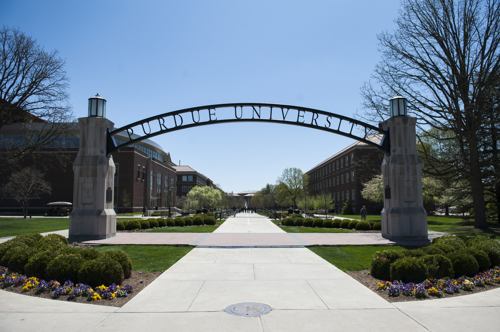
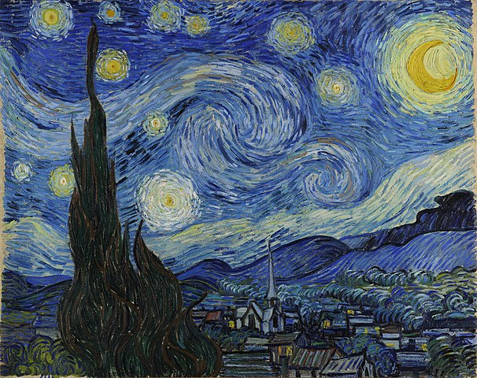
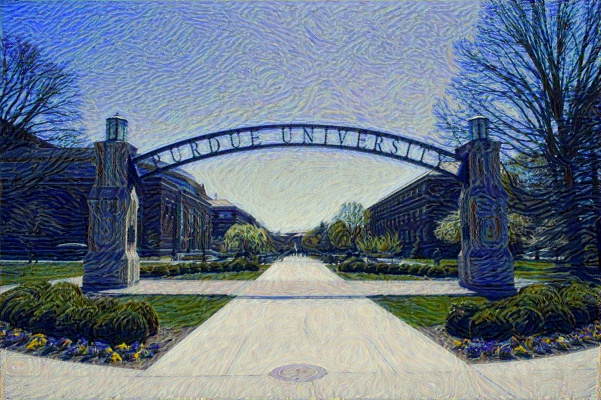

# Transfer image styling
This project uses the VGG-19 pretrained network to transfer the style/texture of an image onto the content of another image. The idea is based on the following paper by Gatys et al.

https://www.cv-foundation.org/openaccess/content_cvpr_2016/papers/Gatys_Image_Style_Transfer_CVPR_2016_paper.pdf

<figure>
  
  <figcaption>Original content image</figcaption>
</figure>

<figure>
  
  <figcaption>Style image: Starry Night</figcaption>
</figure>

<figure>
  
  <figcaption>Final image</figcaption>
</figure>
